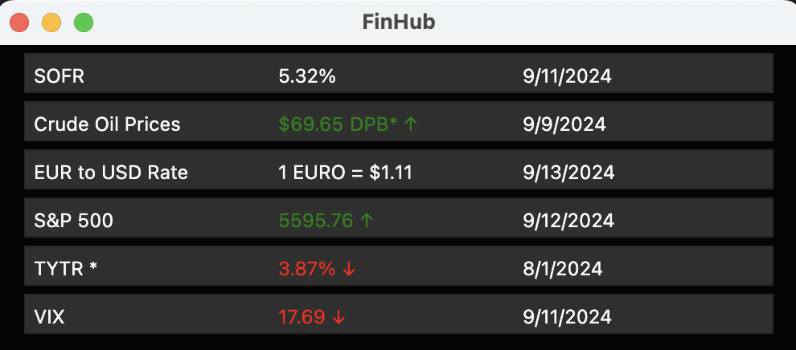

# FinHub

**Description:**

FinHub is a desktop application built using React, JavaScript, Electron Forge, and various APIs to provide users with real-time financial data. It displays key metrics such as:

* **SOFR Rate:** The Secured Overnight Financing Rate, a benchmark interest rate.
* **Crude Oil Prices:** Current prices for different types of crude oil.
* **10-Year Treasury Rate:** The interest rate on 10-year U.S. Treasury bonds.
* **Euro to US Exchange Rate:** The current exchange rate between the euro and the US dollar.
* **VIX Index:** The volatility index, a measure of market fear and uncertainty.
* **S&P 500:** The Standard & Poor's 500 index, a benchmark for US stocks.

**Please note that while FinHub leverages paid APIs for its data, some metrics may not be updated on a day-to-day basis due to the cost associated with premium subscriptions. We strive to provide the most current information possible without compromising affordability.**

**Technologies Used:**

* **React:** A JavaScript library for building user interfaces.
* **JavaScript:** The programming language used to build the application's logic.
* **Electron Forge:** A toolkit for building desktop applications using web technologies.
* **APIs:** Various APIs are used to fetch real-time data for each metric.

**Installation:**

1. **Clone the repository:**
   git clone [https://github.com/nvanschaack/FinHub.git](https://github.com/nvanschaack/FinHub.git)

2. **Install dependencies:**
cd finhub
npm install

3. **Run the application:**
npm start

4. **Make a distributable:**
npm run make

**Usage**
* The application will display the real-time values for each metric in a user-friendly interface.
* Users can customize the display settings to their preference.

**Contributing**
* Vinnie Lopez [github](https://github.com/vinnielo)

**License**
This project is licensed under the MIT License.

